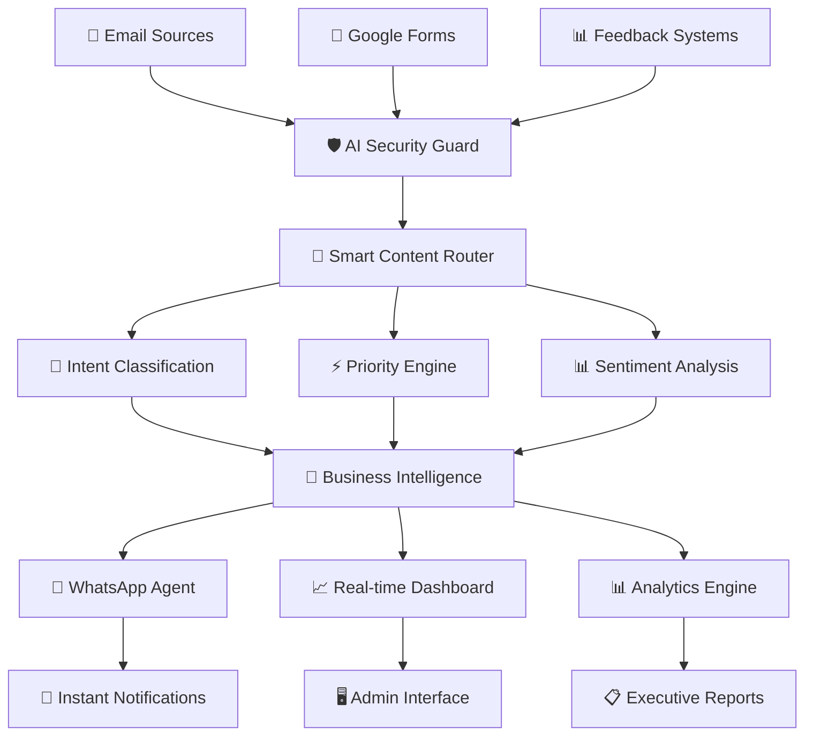

# 🚀 InboxTriage
<div align="center">


[](https://github.com/auraCodesKM/InboxTriage)
[](https://github.com/auraCodesKM/InboxTriage)
[](LICENSE)
[](https://github.com/auraCodesKM/InboxTriage)

</div>

---

## 🌟 **The Revolution Starts Here**

<div align="center">

### *Transform Email Chaos into Business Clarity with AI-Powered Intelligence*

**InboxTriage** is not just another email tool—it's a complete **Business Intelligence Ecosystem** that turns your inbox into a goldmine of actionable insights, delivered instantly via WhatsApp.

</div>

---

## 🎯 **What We Solve**

<table>
<tr>
<td width="33%" align="center">

### 🤖 **AI WhatsApp Agent**
*Smart Business Communication*

🔹 Intelligent message generation  
🔹 Personalized content delivery  
🔹 Optimal timing predictions  
🔹 Rich media & interactive elements  
🔹 Analytics-driven optimization  

</td>
<td width="33%" align="center">

### 🛡️ **Advanced Threat Shield**
*Enterprise-Grade Security*

🔹 98%+ spam detection accuracy  
🔹 Real-time phishing protection  
🔹 Behavioral anomaly detection  
🔹 Multi-layer ML ensemble  
🔹 Zero-day threat intelligence  

</td>
<td width="33%" align="center">

### 😊 **Business Intelligence**
*Sentiment & Analytics Engine*

🔹 Multi-dimensional sentiment analysis  
🔹 Predictive business trends  
🔹 Competitive intelligence  
🔹 Executive report generation  
🔹 ROI impact measurement  

</td>
</tr>
</table>

---

## 🏗️ **Revolutionary Architecture**



---

## ✨ **Key Features**

<div align="center">

| 🚀 **Core Features** | 🎯 **Business Impact** | 🔧 **Technical Excellence** |
|:---:|:---:|:---:|
| Real-time Email Processing | 3-4 Hours Saved Daily | Sub-2s Response Time |
| AI-Powered Task Extraction | 92%+ Accuracy Rate | Microservices Architecture |
| WhatsApp Business Integration | Instant Team Updates | Scalable Cloud Infrastructure |
| Advanced Sentiment Analysis | Competitive Intelligence | Explainable AI Decisions |
| Predictive Analytics | Future Trend Forecasting | Enterprise Security |
| Multi-Source Data Ingestion | Holistic Business View | Real-time WebSocket Updates |

</div>

---

## 🛠️ **Tech Stack**

<div align="center">

### **🧠 AI & Machine Learning**


### **🌐 Backend & APIs**


### **🎨 Frontend & UI**


### **☁️ Deployment & DevOps**


</div>

---

## 🚀 **Quick Start**

### **Prerequisites**
```bash
# Required API Keys (Free Tier)
- Gemini API Key (Google AI Studio)
- Mistral API Key
- Twilio WhatsApp Business API
- Firebase Project Credentials
- Gmail API Credentials
```

### **Installation**
```bash
# Clone the repository
git clone https://github.com/auraCodesKM/InboxTriage.git
cd InboxTriage

# Install dependencies
npm install
pip install -r requirements.txt

# Setup environment variables
cp .env.example .env
# Add your API keys to .env

# Start development servers
npm run dev          # Frontend (Next.js)
python main.py       # Backend (FastAPI)
```

### **Deployment**
```bash
# Frontend Deployment (Vercel)
vercel --prod

# Backend Deployment (Railway)
railway login
railway deploy

# Database Setup (Firebase)
firebase deploy --only firestore
```

---

## 📊 **Success Metrics**

<div align="center">

| Metric | Target | Current Status |
|:------:|:------:|:--------------:|
| 📧 **Task Extraction Accuracy** | >92% | 🚧 In Development |
| 🛡️ **Threat Detection Rate** | >98% | 🚧 In Development |
| 😊 **Sentiment Analysis Precision** | >94% | 🚧 In Development |
| ⚡ **System Response Time** | <1.5s | 🚧 In Development |
| 💼 **Time Saved Per User** | 3-4 hours/day | 🚧 In Development |

</div>

---

## 🎨 **Screenshots & Demo**

<div align="center">

### 📱 **WhatsApp Integration**
*Coming Soon - Beautiful screenshots of our WhatsApp business integration*

### 📊 **Real-time Dashboard**
*Coming Soon - Interactive analytics dashboard with live data*

### 🛡️ **Security Console**
*Coming Soon - Advanced threat detection interface*

</div>

---

## 👥 **Meet the Team**

<div align="center">

<table>
<tr>
<td align="center" width="33%">

### 🚀 **Kavin Thakur**
*Project Lead & Full-Stack Developer*

[](https://www.linkedin.com/in/kavin070810/)

🔹 System Architecture  
🔹 Backend Development  
🔹 AI Integration  
🔹 Project Management  

</td>
<td align="center" width="33%">

### 🧠 **Meharjot Kaur**
*AI/ML Research Specialist*

[](https://www.linkedin.com/in/meharjot-kaur-1bb057333/)

🔹 Machine Learning Models  
🔹 AI Research & Development  
🔹 Sentiment Analysis  
🔹 Predictive Analytics  

</td>
<td align="center" width="33%">

### 🎨 **Yashdeep Singh**
*Frontend & UI/UX Specialist*

[](https://www.linkedin.com/in/yashdeep-singh-887a08245/)

🔹 Frontend Development  
🔹 UI/UX Design  
🔹 Backend Integration  
🔹 User Experience  

</td>
</tr>
</table>

</div>

---

## 🏆 **Hackathon Context**

<div align="center">

### **Design-o-Tech 4.0**
*Pushing the boundaries of innovation beyond traditional problem statements*

**🎯 Problems Addressed:**
- **Primary**: AI-Powered WhatsApp Chatbot
- **Integrated**: Advanced Spam Email Detection  
- **Integrated**: Business Sentiment Analysis

**🚀 Innovation Multiplier**: 3X Impact through creative problem integration

</div>

---

## 📈 **Roadmap**

### **🕐 Phase 1: Foundation (Hours 0-2)**
- [x] Project Setup & Architecture
- [ ] Core AI Security Module
- [ ] Database Schema & APIs
- [ ] Email Processing Pipeline

### **🕑 Phase 2: Intelligence (Hours 2-4)**
- [ ] WhatsApp Business Integration
- [ ] Sentiment Analysis Engine
- [ ] Task Extraction System
- [ ] Business Intelligence Module

### **🕒 Phase 3: Interface (Hours 4-6)**
- [ ] Real-time Dashboard
- [ ] Admin Interface
- [ ] Mobile Optimization
- [ ] Interactive Analytics

### **🕓 Phase 4: Polish (Hours 6-7)**
- [ ] Testing & Optimization
- [ ] Documentation
- [ ] Demo Preparation
- [ ] Production Deployment

---

## 🔒 **License & Usage**

<div align="center">

### **Proprietary License**
*This project is proprietary and confidential.*

**❌ Unauthorized copying, distribution, or modification is strictly prohibited.**  
**✅ For collaboration or licensing inquiries, please contact the team.**

*Protecting innovation through responsible licensing.*

</div>

---

## 🤝 **Contributing**

We welcome contributions from the team! Please follow our development workflow:

1. **Fork** the repository
2. **Create** a feature branch (`git checkout -b feature/AmazingFeature`)
3. **Commit** your changes (`git commit -m 'Add some AmazingFeature'`)
4. **Push** to the branch (`git push origin feature/AmazingFeature`)
5. **Open** a Pull Request

---

## 📞 **Contact & Support**

<div align="center">

### **Get in Touch**

[](https://github.com/auraCodesKM/InboxTriage)
[](mailto:team@inboxtriage.dev)

**🚀 Building the future of business communication, one email at a time.**

</div>

---

<div align="center">

### ⭐ **Star us on GitHub if you find this project interesting!**


---

**Made with 💖 by Team InboxTriage | Design-o-Tech 4.0 Hackathon**

</div>
